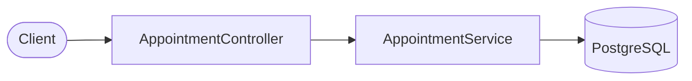
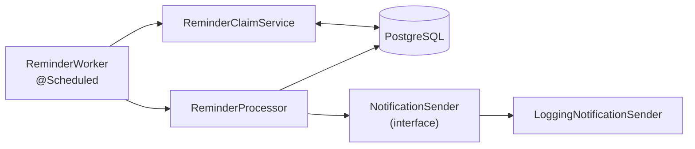

# Appointment Reminder Service

A Spring Boot service that books vehicle service appointments and sends reminder notifications 24 hours
and 2 hours before each appointment. The hard part is not creating appointments — it is guaranteeing that
a customer never receives the same reminder twice while several application instances run the same
reminder worker concurrently, processes crash mid-work, and the notification provider occasionally fails.
PostgreSQL is the single source of truth, and the no-duplicate guarantee is enforced by a database
constraint rather than by application discipline.

---

## Features

All of the following are implemented and covered by automated tests.

| Feature | Detail |
|---|---|
| **Create appointments** | `POST /appointments` with a dealership, customer name, contact, and an ISO-8601 scheduled time carrying an explicit UTC offset. |
| **24-hour reminders** | Scheduled at `appointmentTime − 24h`, as an absolute duration. |
| **2-hour reminders** | Scheduled at `appointmentTime − 2h`, as an absolute duration. |
| **PostgreSQL persistence** | Two tables (`appointments`, `reminders`) managed by Flyway migrations. The `reminders` table doubles as the work queue. |
| **Duplicate reminder protection** | `UNIQUE (appointment_id, reminder_type)` makes a duplicate reminder row unrepresentable. |
| **Concurrent reminder processing** | Multiple instances run the identical scheduled worker; `FOR UPDATE SKIP LOCKED` gives each a disjoint set of rows. No leader election. |
| **Failure and retry recovery** | Per-reminder attempt counting, a retry delay, a terminal `FAILED` state, and a processing timeout that reclaims work abandoned by a crashed worker. |
| **Appointment cancellation** | `POST /appointments/{id}/cancel` — suppresses unsent reminders. Idempotent. |
| **Appointment rescheduling** | `PATCH /appointments/{id}` — moves unsent reminders; reminders already sent are never re-sent. |
| **Notification sender stub** | `LoggingNotificationSender` logs the payload with the customer's contact masked. No external call is made. |
| **REST API** | Four appointment endpoints plus an Actuator health endpoint, with a consistent JSON error body. |
| **Automated tests** | 102 tests, including real-PostgreSQL concurrency tests. |

---

## Architecture

One Spring Boot application, one PostgreSQL database, N identical instances. There is no message broker,
no cache, and no external scheduler.

### Write path



`POST /appointments` validates the request and then, **inside a single transaction**, inserts the
appointment row and its reminder rows. Because it is one transaction, a committed appointment always has
its complete reminder plan — there is no window in which one exists without the other, and no second
system to write to that could fail independently.

### Reminder path



Every instance runs the same `@Scheduled` cycle:

1. Release work abandoned by any crashed worker (one `UPDATE`).
2. Claim a bounded batch of due reminders with `FOR UPDATE SKIP LOCKED`, mark them `PROCESSING`, and
   **commit**.
3. Process each claimed reminder *outside* that transaction — build the notification, send it, and record
   the outcome with a conditional `UPDATE`.

### Why PostgreSQL is the source of truth

The work is time-based, and a table ordered by due time is a natural durable timer: nothing is held in
memory, so nothing is lost on restart. The database also supplies, for free, the three things this problem
actually needs — a transaction spanning the appointment and its reminders, a `UNIQUE` constraint that makes
duplicates unrepresentable, and row-level locking for safe concurrent claiming.

### Why `FOR UPDATE SKIP LOCKED` allows concurrent workers

`FOR UPDATE` locks the selected rows for the duration of the transaction. `SKIP LOCKED` makes a concurrent
transaction **step over** rows another transaction already holds instead of blocking on them. Two workers
running the claim query at the same moment therefore both return immediately, with **disjoint** result
sets. That single SQL clause is the entire multi-instance coordination story — which is why every instance
can run identical code and identical configuration, with no "scheduler node" and no leader election.

---

## Tech Stack

Everything below is present in `pom.xml`. Nothing else is used.

| Technology | Version / source | Role |
|---|---|---|
| Java | 11 | Language level. |
| Spring Boot | 2.7.18 | Application framework. |
| Spring MVC | `spring-boot-starter-web` | REST layer. |
| Spring Data JPA | `spring-boot-starter-data-jpa` | Entities, repositories, transaction management. |
| Bean Validation | `spring-boot-starter-validation` | Request-body validation. |
| Spring Boot Actuator | `spring-boot-starter-actuator` | Health endpoint only. |
| PostgreSQL | 16 (driver via `org.postgresql:postgresql`) | Source of truth and work queue. |
| Flyway | 9.22.3 | Schema migrations. |
| Maven | Maven Wrapper (`./mvnw`) | Build. |
| JUnit 5, Mockito, AssertJ, MockMvc | `spring-boot-starter-test` | Testing. |

> **Note on the Flyway version.** Spring Boot 2.7 manages Flyway 8.5.x, which refuses to run against
> PostgreSQL 16. The `flyway.version` property is pinned to 9.22.3 — the newest release that still supports
> Java 8+ and keeps PostgreSQL support inside `flyway-core`. It logs a harmless "newer than tested" warning
> against PostgreSQL 16.

---

## Project Structure

```text
src/
├── main/
│   ├── java/
│   │   └── com/dealership/appointmentreminder/
│   │       ├── AppointmentReminderApplication.java
│   │       ├── config/             Clock bean, scheduling, typed properties
│   │       ├── controller/         REST endpoints
│   │       ├── dto/                request/response bodies and the notification payload
│   │       ├── entity/             JPA entities and their status/type enums
│   │       ├── exception/          domain exceptions and the API exception handler
│   │       ├── repository/         Spring Data repositories, incl. the claim/reclaim SQL
│   │       ├── scheduler/          the @Scheduled reminder worker
│   │       └── service/            business logic and notification delivery
│   └── resources/
│       ├── application.yml
│       └── db/migration/           V1__create_appointments_and_reminders.sql
└── test/
    ├── java/                       9 test classes + shared test support
    └── resources/
        └── application-test.yml
```

Packages are grouped **by layer**, the conventional Spring Boot arrangement, so a reader can find
any class from its role alone.

| Package | Responsibility |
|---|---|
| `config` | `ClockConfig` (injectable `Clock`), `SchedulingConfig` (`@EnableScheduling`), `ReminderProperties` (typed `reminder.*` settings), `PropertiesConfig`. |
| `controller` | `AppointmentController` — HTTP only: request binding, validation triggering, status-code mapping. No business logic. |
| `dto` | `CreateAppointmentRequest`, `RescheduleAppointmentRequest`, `AppointmentResponse`, `ReminderResponse`, `ApiError`, and the `Notification` value object passed to the sender. The request types use `OffsetDateTime`, which is how the API's time-zone contract is enforced. |
| `entity` | `Appointment` and `Reminder` JPA entities, plus the `AppointmentStatus`, `ReminderStatus` and `ReminderType` enums. `ReminderType` carries each reminder's offset, which is the Open/Closed mechanism. |
| `exception` | `AppointmentNotFoundException`, `InvalidAppointmentRequestException`, `InvalidAppointmentStateException`, and `ApiExceptionHandler` which maps them to HTTP statuses. |
| `repository` | `AppointmentRepository` (including the row-locking `findByIdForUpdate`) and `ReminderRepository` (the `FOR UPDATE SKIP LOCKED` claim and the stale-work reclaim). |
| `scheduler` | `ReminderWorker` — the `@Scheduled` trigger. Orchestration only: reclaim, claim, process. |
| `service` | `AppointmentService` (business logic and the transaction boundary), `ReminderScheduleCalculator` (timing rules), `ReminderClaimService` (the claim transaction), `ReminderProcessor` (one reminder's outcome), plus the `NotificationSender` interface and its `LoggingNotificationSender` stub. |

Test packages mirror this layout, with an extra `integration` package for the two suites that
deliberately span every layer, and `support` for shared test fixtures.

---

## API Endpoints

All request and response bodies are `application/json`. Timestamps are accepted as ISO-8601 **with an
explicit offset** and returned normalised to UTC (`Z`).

### `POST /appointments`

Creates an appointment and its reminders atomically.

```bash
curl -X POST http://localhost:8080/appointments \
  -H 'Content-Type: application/json' \
  -d '{
        "dealershipId": 42,
        "customerName": "Ada Lovelace",
        "customerContact": "ada@example.com",
        "scheduledAt": "2026-10-20T14:30:00-04:00"
      }'
```

**`201 Created`**

```json
{
  "id": 5,
  "dealershipId": 42,
  "customerName": "Ada Lovelace",
  "customerContact": "ada@example.com",
  "scheduledAt": "2026-10-20T18:30:00Z",
  "status": "SCHEDULED",
  "createdAt": "2026-09-12T18:56:38.188842Z",
  "updatedAt": "2026-09-12T18:56:38.188842Z",
  "reminders": [
    { "id": 5, "type": "TWENTY_FOUR_HOURS", "scheduledAt": "2026-10-19T18:30:00Z", "status": "PENDING", "attemptCount": 0, "sentAt": null },
    { "id": 6, "type": "TWO_HOURS",         "scheduledAt": "2026-10-20T16:30:00Z", "status": "PENDING", "attemptCount": 0, "sentAt": null }
  ]
}
```

The response returns the reminder plan, so an appointment booked close to its slot visibly has fewer than
two reminders.

| Status | When |
|---|---|
| `400 VALIDATION_FAILED` | A required field is missing. |
| `400 MALFORMED_REQUEST` | Unparseable JSON, or a timestamp with no offset. |
| `400 INVALID_REQUEST` | Scheduled time is not in the future, or the contact is neither an email address nor a phone number. |

### `GET /appointments/{id}`

Returns the appointment with the full state of every reminder — status, attempt count and send time. This
is the endpoint that demonstrates the no-duplicate guarantee from outside the system.

```bash
curl http://localhost:8080/appointments/5
```

`200 OK` with the same body shape as above, or `404 APPOINTMENT_NOT_FOUND`.

### `POST /appointments/{id}/cancel`

Cancels the appointment and suppresses its unsent reminders. Idempotent — cancelling twice returns `200`
both times.

```bash
curl -X POST http://localhost:8080/appointments/5/cancel
```

`200 OK` with the appointment now `CANCELLED` and its `PENDING` reminders `CANCELLED`. Returns
`404 APPOINTMENT_NOT_FOUND` for an unknown id, or `409 INVALID_APPOINTMENT_STATE` if the appointment is
already `COMPLETED`.

### `PATCH /appointments/{id}`

Moves the appointment to a new time and recomputes its unsent reminders.

```bash
curl -X PATCH http://localhost:8080/appointments/5 \
  -H 'Content-Type: application/json' \
  -d '{"scheduledAt": "2026-10-25T09:00:00-04:00"}'
```

`200 OK`. Returns `404` for an unknown id, `409 INVALID_APPOINTMENT_STATE` if the appointment is not
`SCHEDULED`, or `400` for a missing/past/malformed time.

### `GET /actuator/health`

```bash
curl http://localhost:8080/actuator/health
# {"status":"UP"}
```

Health is the **only** Actuator endpoint exposed.

### Endpoints that do **not** exist

- **`DELETE /appointments/{id}` is not implemented.** Cancellation is a state transition, not a deletion —
  the appointment and its reminder history are kept for auditability. This path returns
  `405 METHOD_NOT_ALLOWED`.
- **`GET /appointments` (list) is not implemented.** It returns `405 METHOD_NOT_ALLOWED`.

### Error body

Every error uses one shape:

```json
{
  "timestamp": "2026-09-12T18:56:38.766522Z",
  "status": 404,
  "error": "APPOINTMENT_NOT_FOUND",
  "message": "Appointment not found: 999999",
  "details": null
}
```

`details` carries per-field messages on validation failures and is `null` otherwise. Error codes in use:
`VALIDATION_FAILED`, `MALFORMED_REQUEST`, `INVALID_REQUEST`, `APPOINTMENT_NOT_FOUND`,
`INVALID_APPOINTMENT_STATE`, `METHOD_NOT_ALLOWED`, `UNSUPPORTED_MEDIA_TYPE`, `INTERNAL_ERROR`.

---

## Reminder Scheduling

Reminder times are computed by `ReminderScheduleCalculator`, a pure class with no database or Spring
dependency — "now" is passed in as a parameter, which is what makes every timing rule unit-testable at a
fixed instant.

### How each reminder time is calculated

`ReminderType` is an enum that carries its own offset, and the calculator iterates `ReminderType.values()`:

```text
TWENTY_FOUR_HOURS  dueAt = appointmentScheduledAt − 24 hours
TWO_HOURS          dueAt = appointmentScheduledAt − 2 hours
```

The subtraction is **absolute instant arithmetic**, not "the same wall-clock time yesterday". Across a
daylight-saving transition those differ by an hour; using instants means "24 hours before" means exactly
24 hours and needs no special case.

There is deliberately **no `switch` on reminder type** anywhere in the scheduling or processing code.
Adding a 30-minute reminder would be one new enum constant and nothing else.

### The grace period, and appointments booked close to their slot

A reminder row is created only if its due time is **not more than the grace period in the past**:

```text
create the reminder   if   dueAt >= now − gracePeriod        (gracePeriod = 15 minutes, configurable)
otherwise             create nothing, and log why at INFO
```

The grace period exists because a reminder whose due time passed a few minutes ago is a *late* reminder and
still worth sending, while one whose due time passed many hours ago would be a *wrong* message — telling a
customer "your appointment is tomorrow" three hours beforehand is worse than saying nothing.

An appointment booked too close to its slot therefore gets fewer reminders, or none. **This is not an
error**: the appointment is created successfully and the response shows exactly which reminders exist.

| Booked | Appointment at | 24-hour reminder | 2-hour reminder |
|---|---|---|---|
| T − 30 days | T | created | created |
| T − 25 hours | T | created, due in ~1 hour | created |
| T − 23h 45m | T | created (due exactly 15 min ago — the boundary is inclusive) | created |
| T − 23h 44m | T | **not created** | created |
| T − 12 hours | T | **not created** | created |
| T − 1h 50m | T | **not created** | created (due 10 min ago, inside grace) |
| T − 1h 44m | T | **not created** | **not created** |
| T − 30 minutes | T | **not created** | **not created** |

A reminder created with a due time slightly in the past needs no special "fire immediately" path: the claim
query matches `scheduled_at <= now`, so the next worker cycle picks it up naturally.

### A note on message content

The notification payload carries the **absolute appointment time**, never a relative phrase like "in 24
hours". That one choice is what makes a reminder delivered slightly late still *correct*, and is therefore
what makes a polling worker safe.

---

## Reminder Processing

### States

| Status | Terminal | Meaning |
|---|---|---|
| `PENDING` | no | Needs processing. May not be due yet, may be due and waiting for a worker, or may be waiting out the retry delay after a failed attempt. |
| `PROCESSING` | no | A worker has claimed this row and is working on it. Reclaimable by any worker once `processing_until` passes. |
| `SENT` | yes | **Notification processing completed successfully** — the sender returned without error. Deliberately *not* a claim that the customer received exactly one message (see below). |
| `FAILED` | yes | Retries exhausted, or a permanent error. Needs human attention. |
| `CANCELLED` | yes | The appointment was cancelled before this reminder was processed. |

### Happy path

```text
PENDING ──claim (SKIP LOCKED)──▶ PROCESSING ──send succeeds──▶ SENT
```

### Failure and recovery paths

```text
PROCESSING ──send fails, attempts remain──▶ PENDING   (retried after the retry delay)
PROCESSING ──send fails, attempts exhausted──▶ FAILED
PROCESSING ──processing_until expires (worker crashed)──▶ PENDING ──▶ PROCESSING
PROCESSING ──appointment no longer SCHEDULED──▶ CANCELLED
```

### The claim query

```sql
SELECT * FROM reminders
 WHERE status = 'PENDING'
   AND scheduled_at <= :now
   AND (last_attempt_at IS NULL OR last_attempt_at <= :retryCutoff)
 ORDER BY scheduled_at
 LIMIT :batchSize
 FOR UPDATE SKIP LOCKED;
```

`status = 'PENDING'` is what excludes reminders that are already `SENT`, `FAILED`, `CANCELLED` or in
flight — a terminal reminder is never handed to a processor in the first place. `LIMIT :batchSize` is the
backpressure limit: a worker never takes on more work in one cycle than it is configured to handle.

Claimed rows are marked `PROCESSING` with `processing_until = now + processingTimeout`, and **the claim
transaction commits before anything is sent**. That ordering is deliberate: a slow notification provider
must never hold database row locks, and `PROCESSING` needs to be a durable "someone is working on this"
marker for timeout-based recovery to be possible.

### Processing timeout and stale reminder recovery

When a worker is killed — `kill -9`, OOM, node loss, deploy — its claimed rows simply stop changing. The
first statement of every worker cycle is:

```sql
UPDATE reminders
   SET status = 'PENDING', processing_until = NULL,
       attempt_count = attempt_count + 1, updated_at = :now
 WHERE status = 'PROCESSING' AND processing_until < :now;
```

Within one processing timeout (default 1 minute) those rows become claimable again and any worker picks
them up. No operator action, no heartbeat table, no leader election. The statement is idempotent, so
running it concurrently on every instance is safe.

`attempt_count` is incremented on reclaim as well as on send failure, so a reminder that repeatedly kills
its worker eventually exhausts its attempts and is failed rather than looping forever.

### Retry and attempt limit

- On a send failure, `attempt_count` is incremented and `last_attempt_at` is stamped. If
  `attempt_count + 1 >= maxAttempts` (default 5) the reminder goes to `FAILED`; otherwise it returns to
  `PENDING`.
- The claim query will not pick it up again until `retryDelay` (default 5 minutes) has elapsed since the
  last attempt.
- A reminder that arrives at the processor with `attempt_count >= maxAttempts` — reachable only through
  repeated crash-and-reclaim — is marked `FAILED` **without being sent**.

### Outcome writes are guarded

Every outcome write is a conditional statement naming the expected current state:

```sql
UPDATE reminders SET status = 'SENT', sent_at = :now, ...
 WHERE id = :id AND status = 'PROCESSING';
```

There is no read-then-write anywhere on the processing path, so there is no lost-update window. The
affected row count answers "did I still own this reminder?" — a count of `0` means another worker reclaimed
it after the processing timeout, and the late worker stops rather than overwriting the new owner's state.

### Cancellation behaviour

`cancel` reads the appointment with `SELECT … FOR UPDATE` and transitions only `PENDING` reminders to
`CANCELLED`. A reminder already `SENT` stays `SENT` — it cannot be unsent. A reminder currently
`PROCESSING` belongs to a worker, which re-reads the appointment before sending and suppresses the
notification itself if the appointment is no longer `SCHEDULED`.

### Rescheduling behaviour

`reschedule` takes the same row lock, then for each reminder type:

- `SENT` and `FAILED` reminders are left untouched — **no second reminder of the same type is ever sent**.
- `PROCESSING` reminders are left untouched — a worker owns them.
- `PENDING` and `CANCELLED` reminders are recomputed against the new time: set back to `PENDING` if the new
  due time is still worth sending, or `CANCELLED` if it has now passed.
- A type with no row yet is inserted if its new due time is worth sending.

`CANCELLED` is reschedulable so that moving an appointment earlier and then later again revives the
reminder; without that, the unique constraint would prevent re-creating it.

---

## Concurrency

Multiple application instances can run simultaneously with **identical configuration**. There is no
scheduler node, no leader election, and no distributed lock — all mutual exclusion lives in the database,
the only component every instance shares.

### How `FOR UPDATE SKIP LOCKED` prevents a double claim

1. Worker A opens a transaction and runs the claim query. `FOR UPDATE` takes a row lock on the rows it
   selects, held until A's transaction ends.
2. Worker B runs the identical query at the same moment. Without `SKIP LOCKED` it would **block** waiting
   for A's lock. With `SKIP LOCKED` it steps over the locked rows and returns a **different** set
   immediately.
3. Each worker marks its own rows `PROCESSING` and commits. Once committed, those rows are no longer
   `PENDING`, so no other worker's query will match them.

Two properties matter here, and only `SKIP LOCKED` gives both: workers get **disjoint** rows, and no worker
**waits** on another. Blocking would serialise the whole fleet behind the slowest worker.

### What the tests verify

`ReminderClaimConcurrencyIntegrationTest` runs against real PostgreSQL with real threads:

- `shouldSkipRowLockedByAnotherWorkerInsteadOfBlocking` — worker A holds a genuine row lock inside an open
  transaction while worker B runs the identical query. The test asserts both that B receives a *different*
  row and that B returned in well under the time A held its lock. The timing half is what distinguishes
  `SKIP LOCKED` from a plain `FOR UPDATE`.
- `shouldClaimReminderOnlyOnceWhenWorkersRunConcurrently` — eight threads claim simultaneously and take
  eight different reminders, with no duplicates.
- `NoDuplicateReminderGuaranteeTest` runs eight concurrent workers against a single due reminder and
  asserts the customer was contacted **exactly once**.

These are deliberately **not** Mockito tests. The behaviour under test lives inside PostgreSQL; a mock
could only assert that a method was called, not that two workers received different rows.

---

## Duplicate Reminder Guarantee

This is the assignment's central requirement, and it is answered at three distinct layers.

### 1. Duplicate reminder creation — prevented absolutely

```sql
CONSTRAINT uq_reminders_appointment_type UNIQUE (appointment_id, reminder_type)
```

A second reminder of the same type for the same appointment is not merely prevented — it is
**unrepresentable**. Any code path that attempts it, present or future, fails loudly with a constraint
violation rather than quietly double-sending. The guarantee is a property of the schema, verifiable by
reading the DDL, and `NoDuplicateReminderGuaranteeTest` proves it by bypassing every line of application
code and attempting the insert in raw SQL.

This invariant query must always return zero rows:

```sql
SELECT appointment_id, reminder_type, count(*)
  FROM reminders
 GROUP BY appointment_id, reminder_type
HAVING count(*) > 1;
```

### 2. Concurrent reminder claiming — prevented by row locking

Two workers cannot claim the same `PENDING` reminder, because the claim happens inside a transaction that
holds a row lock and `SKIP LOCKED` makes concurrent claims disjoint. Additionally, every outcome write is
conditional on the reminder still being `PROCESSING`, so a worker that lost its claim cannot overwrite the
new owner's state.

### 3. External notification delivery — at-least-once, not exactly-once

> **The system guarantees exactly-once reminder scheduling and an exactly-once dispatch decision under the
> database concurrency model, but external exactly-once delivery cannot be guaranteed, because sending an
> external notification and updating database state are not one atomic transaction.**

**The crash scenario.** A worker claims a reminder (committed as `PROCESSING`), calls the notification
provider, and the provider accepts the message — then the process dies before the `SENT` status is written.
The claim expires, another worker reclaims the reminder, and it is sent again. The customer receives two
messages.

Committing `SENT` *before* calling the provider would remove that risk but introduce a worse one: a crash
between the commit and the send would lose the reminder entirely. **At-least-once with a rare duplicate was
chosen deliberately over at-most-once with a possible miss.**

**How the gap is closed in a real deployment.** The `Notification` passed to the sender carries the
reminder's database id, which is a **stable idempotency key** — it does not change between attempts.
`shouldKeepReminderIdStableAcrossRetries` pins this behaviour. A real provider that honours idempotency
keys would collapse the repeat, making delivery *effectively* once. With a provider that does not, a rare
genuine duplicate remains possible.

**Therefore `SENT` means "notification processing completed successfully", not "the customer definitely
received exactly one message".** The code, the tests and this document all use that meaning consistently.

---

## Failure Handling

| Scenario | Behaviour |
|---|---|
| **Invalid request** | Bean Validation rejects missing fields with `400 VALIDATION_FAILED` and a per-field `details` list. Business rules — past scheduled time, a contact that is neither email nor phone — produce `400 INVALID_REQUEST`. A timestamp without a UTC offset cannot be parsed into `OffsetDateTime` and produces `400 MALFORMED_REQUEST`, rather than being silently interpreted in the server's own time zone. |
| **Appointment not found** | `404 APPOINTMENT_NOT_FOUND` from `GET`, cancel and reschedule. |
| **Invalid state transition** | `409 INVALID_APPOINTMENT_STATE` when rescheduling a non-`SCHEDULED` appointment or cancelling a `COMPLETED` one. |
| **Duplicate reminders** | Rejected by the database unique constraint. |
| **Notification sender failure** | The exception is caught by `ReminderProcessor`, recorded against that one reminder, and never rethrown. `attempt_count` is incremented, `last_attempt_at` stamped, and the reminder returns to `PENDING` — or goes to `FAILED` once the attempt limit is reached. One bad recipient cannot abandon the rest of the batch. |
| **Stale `PROCESSING` reminders** | Reclaimed to `PENDING` by the first statement of every worker cycle once `processing_until` has passed. |
| **Cancelled appointments** | Pending reminders are cancelled at the point of cancellation. A reminder already claimed is suppressed by the processor, which re-reads the appointment before sending. |
| **Application restart** | No reminder state is held in memory, so a restart loses nothing. Pending reminders are still in the table, and reminders left `PROCESSING` by the killed instance are reclaimed once their timeout expires. |
| **Database failures** | An exception during claiming or reclaiming is caught and logged by `ReminderWorker`, and the next cycle retries. This matters more than it looks: an exception escaping a `@Scheduled` method stops all of that method's future executions, which would silently halt reminder delivery for the whole instance. |
| **Unhandled exceptions in the web layer** | Logged in full and returned as `500 INTERNAL_ERROR` with no internal detail exposed. Spring MVC's own exceptions keep their intended statuses (`405`, `415`) because `ApiExceptionHandler` extends `ResponseEntityExceptionHandler`. |
| **Poison reminder** | A reminder that always fails cannot block others: `attempt_count` and `last_attempt_at` are per row, so the claim query steps past it and it reaches `FAILED` after the limit. |

---

## Testing

```text
Total tests: 102
Passed:      102
Failed:      0
Skipped:     0
```

| Test class | Tests | Covers |
|---|---|---|
| `ReminderScheduleCalculatorTest` | 13 | Timing rules as pure unit tests — 24h and 2h offsets, grace-period boundaries (inclusive at exactly one grace period, excluded one second beyond), DST-safe absolute arithmetic. No Spring, no database. |
| `AppointmentApiIntegrationTest` | 32 | The full HTTP contract via MockMvc: creation and persistence, every validation rule, cancellation, rescheduling, and the `400`/`404`/`405`/`409`/`415` status matrix. |
| `ReminderClaimConcurrencyIntegrationTest` | 11 | Real threads against real PostgreSQL: `SKIP LOCKED` disjoint and non-blocking claiming, what must never be claimed (not-yet-due, terminal, in-flight, inside the retry delay), batch-size bound, and stale-claim recovery. |
| `ReminderProcessorIntegrationTest` | 9 | Send success, transient failure and retry, give-up at the attempt limit, already-exhausted attempts, appointment cancelled after the claim, and a lost claim. |
| `DatabaseIntegrityIntegrationTest` | 13 | Unique constraint, foreign key, cascade delete, timestamp fidelity, the `SENT`/`sent_at` invariant, guarded outcome writes, index existence, and a volume sanity check. |
| `NoDuplicateReminderGuaranteeTest` | 7 | The assignment requirement at all three layers, including eight concurrent workers delivering a single reminder exactly once, and a stable idempotency key across retries. |
| `EndToEndReminderFlowIntegrationTest` | 7 | Book over HTTP → persisted → claimed → sent, through the real `LoggingNotificationSender`. Restart simulation, stale-claim recovery, and partial batch failure. |
| `ReminderWorkerTest` | 5 | Orchestration order and error containment, with Mockito. |
| `LoggingNotificationSenderTest` | 5 | Payload logged, contact masked, nothing sent externally. |

**Concurrency tests use real PostgreSQL, not H2.** H2 does not implement `FOR UPDATE SKIP LOCKED`, so
testing the claim query against an in-memory database would be testing behaviour that does not exist in
production. For the same reason the integration tests clean up by deletion rather than by `@Transactional`
rollback: data written in an uncommitted test transaction is invisible to other threads, and rolling back
would not undo what they committed.

All time-dependent tests drive an injected `Clock` (`MutableTestClock`), so a reminder due in 30 days is
verified in milliseconds with no `Thread.sleep` and no dependence on the machine clock.

### Running the tests

```bash
./mvnw clean test
```

The suite needs a running PostgreSQL, a database named `appointment_reminder_test` (see below), and
`DB_USERNAME` exported. It does **not** need Docker.

---

## How to Run Locally

### Prerequisites

- **Java 11.** The build targets Java 11 (`maven.compiler.source/target`). Set `JAVA_HOME` to a Java 11
  JDK before building — if a much newer JDK is first on the path, Maven will use it and the Spring Boot
  2.7 runtime may fail to start.
- **PostgreSQL 16** running on `localhost:5432`.
- **Maven Wrapper** — included as `./mvnw`; no separate Maven installation is required.

### Database

Create the two databases — one for the application, one for the test suite:

```bash
createdb appointment_reminder
createdb appointment_reminder_test
```

The schema is created automatically by Flyway on first start; `spring.jpa.hibernate.ddl-auto` is set to
`validate`, so Hibernate only verifies that the entities match the migrated schema.

**Credentials** are read from environment variables and are not stored in the repository:

```bash
export DB_USERNAME=YOUR_DB_USERNAME
export DB_PASSWORD=YOUR_DB_PASSWORD   # may be empty for a local trust-auth setup
```

These map to `spring.datasource.username` and `spring.datasource.password` in
`src/main/resources/application.yml`, which reference `${DB_USERNAME}` and `${DB_PASSWORD:}`.

> **`DB_USERNAME` is required and has no default.** If it is not set, the application fails fast at
> startup with an unresolved-placeholder error rather than silently connecting as some other user. The
> same applies to the test suite, which reads `src/test/resources/application-test.yml`. `DB_PASSWORD`
> defaults to empty, which is what a local `trust`-authentication PostgreSQL expects.

### Run

```bash
# Point the build at a Java 11 JDK, e.g. on macOS:
export JAVA_HOME=/path/to/your/java-11-jdk

# Required - there is no default
export DB_USERNAME=YOUR_DB_USERNAME
export DB_PASSWORD=YOUR_DB_PASSWORD   # may be empty locally

./mvnw clean test          # build and run all 102 tests
./mvnw spring-boot:run     # start the service on http://localhost:8080
```

Health check:

```bash
curl http://localhost:8080/actuator/health
# {"status":"UP"}
```

### Running several instances

To demonstrate multi-instance safety, start a second instance on another port against the same database:

```bash
SERVER_PORT=8081 ./mvnw spring-boot:run
```

Both instances run the identical worker. No configuration differs between them.

---

## Example API Usage

```bash
# 1. Create an appointment 30 days out — both reminders are created
curl -X POST http://localhost:8080/appointments \
  -H 'Content-Type: application/json' \
  -d '{
        "dealershipId": 42,
        "customerName": "Ada Lovelace",
        "customerContact": "ada@example.com",
        "scheduledAt": "2026-10-20T14:30:00-04:00"
      }'

# 2. Read it back with the full state of its reminders
curl http://localhost:8080/appointments/5

# 3. Reschedule it — unsent reminders move; reminders already sent are untouched
curl -X PATCH http://localhost:8080/appointments/5 \
  -H 'Content-Type: application/json' \
  -d '{"scheduledAt": "2026-10-25T09:00:00-04:00"}'

# 4. Cancel it — pending reminders become CANCELLED and never fire
curl -X POST http://localhost:8080/appointments/5/cancel
```

Two more worth trying, because they show the scheduling rules directly:

```bash
# Booked 3 hours ahead -> only the 2-hour reminder is created, because the
# 24-hour reminder's due time is already well in the past
AT=$(python3 -c "import datetime; print((datetime.datetime.now(datetime.timezone.utc) \
     + datetime.timedelta(hours=3)).replace(microsecond=0).isoformat())")
curl -X POST http://localhost:8080/appointments \
  -H 'Content-Type: application/json' \
  -d "{\"dealershipId\":1,\"customerName\":\"Alan Turing\",
       \"customerContact\":\"+15551234567\",\"scheduledAt\":\"$AT\"}"

# Verify the no-duplicate invariant directly in the database (must return no rows)
psql -d appointment_reminder -c \
  "SELECT appointment_id, reminder_type, count(*) FROM reminders
    GROUP BY appointment_id, reminder_type HAVING count(*) > 1;"
```

---

## Configuration

All settings live in `src/main/resources/application.yml`.

### Database and server

| Property | Default | Purpose |
|---|---|---|
| `spring.datasource.url` | `jdbc:postgresql://localhost:5432/appointment_reminder` | Database location. |
| `spring.datasource.username` | `${DB_USERNAME}` - **required, no default** | Database user. Startup fails fast if unset. |
| `spring.datasource.password` | `${DB_PASSWORD:}` - defaults to empty | Database password. Empty suits local trust authentication. |
| `spring.datasource.hikari.maximum-pool-size` | `10` | One instance serves both the API and the reminder worker from this pool. |
| `spring.jpa.hibernate.ddl-auto` | `validate` | Flyway owns the schema; Hibernate only checks the entities match it. |
| `spring.jpa.open-in-view` | `false` | No lazy loading outside a transaction. |
| `server.port` | `8080`, overridable with `SERVER_PORT` | HTTP port. |
| `management.endpoints.web.exposure.include` | `health` | Only the health endpoint is exposed. |

### Time zone

Two settings, and one line of code, make time handling unambiguous:

- `spring.jpa.properties.hibernate.jdbc.time_zone: UTC` pins Hibernate to UTC.
- `AppointmentReminderApplication.main` sets the **JVM default time zone to UTC** before Spring starts, so
  no component can accidentally depend on the server's local zone.
- All timestamps are stored in `TIMESTAMPTZ` columns and handled in Java as `Instant`. `LocalDateTime`
  appears nowhere in persistence or in the API contract.

### Reminder worker

| Property | Default | Purpose |
|---|---|---|
| `reminder.poll-interval-ms` | `10000` | How often each instance runs a worker cycle. |
| `reminder.batch-size` | `100` | Maximum reminders claimed per cycle — the backpressure limit. |
| `reminder.processing-timeout` | `PT1M` | How long a claim survives before any worker may reclaim it. |
| `reminder.retry-delay` | `PT5M` | How long after a failed attempt before the reminder is eligible again. |
| `reminder.max-attempts` | `5` | Attempts before a reminder is marked `FAILED`. |
| `reminder.grace-period` | `PT15M` | How far in the past a reminder's due time may be and still be worth creating. |

---

## Scaling Considerations

### The arithmetic

```text
 50,000 appointments/day
×      2 reminders each
= 100,000 reminders/day
÷ 86,400 seconds
≈   1.16 reminders/second average
```

Bookings and reminders cluster in business hours, so assume a 20× peak — roughly **25 reminders/second**.
With a 10-second poll interval and a batch size of 100, one instance can move 100 reminders per cycle,
about **10/second sustained from a single-threaded loop**. The average load runs comfortably on one
instance; the peak is covered by a second instance.

Stating the number matters: **this workload is small.** The engineering difficulty here is correctness
under concurrent workers and crashes, not throughput. Introducing a message broker to move 25 messages per
second would be solving a problem this system does not have.

### The role of indexes

| Index | Serves |
|---|---|
| `idx_reminders_status_scheduled (status, scheduled_at)` | The claim query. Both predicates are covered, so claiming is an index range scan rather than a table scan. |
| `idx_reminders_status_processing_until (status, processing_until)` | The stale-work reclaim query. |
| `uq_reminders_appointment_type (appointment_id, reminder_type)` | The duplicate guarantee, and lookups by appointment. |
| `idx_appointments_dealership_scheduled (dealership_id, scheduled_at)` | Tenant-scoped appointment queries; the tenant column leads because every such query is tenant-scoped. |

`DatabaseIntegrityIntegrationTest` asserts these indexes exist and that the claim query's predicates can be
served by `idx_reminders_status_scheduled`.

### Horizontal scaling

Adding instances requires no configuration change: every instance runs the same worker, and `SKIP LOCKED`
keeps their claims disjoint. Losing an instance costs at most one processing timeout of progress.

### What the tests do and do not show

`shouldClaimABoundedBatchPromptlyFromALargeBacklog` inserts several thousand pending reminders (2,000
appointments with two reminders each) and confirms a bounded batch is still claimed promptly. **This is a sanity check, not a capacity benchmark.**
No unit or integration test on a developer machine proves production capacity, which depends on hardware,
connection pool sizing, network latency and the real notification provider's throughput. Proper load
testing against production-like infrastructure would be required to make any capacity claim.

### Known limitation

Due reminders are processed in global `scheduled_at` order, so one dealership bulk-loading tens of
thousands of appointments delays other dealerships by that burst's drain time — minutes at this volume.
Per-dealership fair scheduling is not implemented.

### What I Would Improve With Another Week

None of these are implemented; they are the next things I would build.

1. **Provider-side idempotency.** Pass the reminder id to a real provider as its idempotency key, which
   would upgrade delivery from at-least-once to effectively-once.
2. **Metrics and observability.** Micrometer counters and a histogram for dispatch lateness, plus an alert
   on the age of the oldest overdue `PENDING` reminder — the single most useful health signal for this
   system. Today the answer comes from a SQL query and structured logs.
3. **An operational endpoint for `FAILED` reminders.** Listing and retrying them currently requires
   database access.
4. **Smarter retry and backoff.** The retry delay is a fixed interval; exponential backoff with jitter, and
   distinguishing permanent failures (invalid address) from transient ones (provider timeout), would avoid
   wasting five attempts on an address that will never work.
5. **Load testing.** Against production-like infrastructure, to replace the design argument in this section
   with measurements.
6. **Production deployment configuration.** Externalised secrets management, connection-pool tuning for
   the real instance count, and a least-privilege database user.
7. **Multi-channel delivery.** Adding a `channel` column and widening the unique constraint to
   `(appointment_id, reminder_type, channel)`, with a small sender registry to route between
   implementations.
8. **Fencing on the claim.** Including the claimed `processing_until` in the outcome `UPDATE` would close
   the slow-worker race described below, at the cost of one extra predicate.
9. **Per-dealership fair scheduling**, so one bulk import cannot delay other tenants.
10. **Archival** of terminal reminders older than a retention window.

---

## Design Decisions

### Why PostgreSQL?

The application needs durable transactional state, and this problem needs three things the database already
provides: a transaction spanning the appointment and its reminders, a `UNIQUE` constraint that makes
duplicates unrepresentable, and row-level locking for safe concurrent claiming. Using one storage system
means one transaction manager and no cross-store consistency problem.

### Why `FOR UPDATE SKIP LOCKED`?

It is the whole multi-instance coordination mechanism, in one SQL clause. `FOR UPDATE` reserves the rows;
`SKIP LOCKED` makes concurrent workers step over rows another transaction holds rather than blocking. The
result is disjoint claims with no waiting, which is why every instance can run identical configuration with
no leader election.

### Why a scheduled worker?

The work is time-based, and a table of future work polled by due time is a natural durable timer. Nothing
is held in memory, so a restart loses nothing, and a per-row `last_attempt_at` gives free per-item retry
scheduling. At roughly 1.2 reminders per second, one indexed query every 10 seconds per instance is a
negligible cost.

### Why not Kafka, RabbitMQ, or Redis?

- **Kafka / RabbitMQ**: brokers do not natively hold work for 24 hours — Kafka has no delay primitive at
  all — so a table of future work polled by due time would still be needed. It would be this design *plus*
  a broker, and the broker's at-least-once redelivery and consumer rebalances would add new duplicate
  sources rather than remove any. At ~25 reminders per second it solves no problem this system has.
- **Redis**: a distributed lock there would be *weaker* than the row lock PostgreSQL already provides, and
  it adds a second state store that can fail independently of the source of truth.

I would revisit a broker at substantially larger scale, or if notifications became a capability shared
across several services.

### Why an interface for `NotificationSender`?

It is the seam between reminder processing and the outside world. `ReminderProcessor` depends on the
interface and never on the logging implementation, so adding email, SMS or push delivery requires no change
to processing, retry or state-transition logic. The payoff is immediate rather than theoretical: the tests
inject a sender that fails, one that throws, and one that counts invocations — which is how the retry and
concurrency tests are possible at all.

---

## SOLID / Design Principles

Each principle below is tied to specific classes in this repository.

### Single Responsibility

Responsibilities are split so that each class has one reason to change:

- `AppointmentController` — HTTP only: binding, validation triggering, status mapping. No business rules.
- `AppointmentService` — business logic and the transaction boundary. No HTTP, no SQL.
- `ReminderScheduleCalculator` — time arithmetic only, with no database or Spring dependency. This is the
  split that pays off most: the timing rules are where the edge cases live, and separating them makes all
  13 of their tests run without a database.
- `ReminderWorker` — decides *when* work happens; holds no business logic.
- `ReminderClaimService` — owns the claim transaction and nothing else.
- `ReminderProcessor` — one reminder's outcome; the single place to read to understand delivery semantics.
- `ReminderRepository` / `AppointmentRepository` — database access.

`ReminderClaimService` being separate from `ReminderWorker` is not stylistic. Spring's `@Transactional` is
applied by a proxy; if the worker called its own transactional claim method, the call would bypass the
proxy and run with **no transaction at all**. Row locks are released at transaction end, so `SKIP LOCKED`
would silently stop providing mutual exclusion.

### Open/Closed

`ReminderType` is an enum that carries its own `Duration`, and `ReminderScheduleCalculator` iterates
`ReminderType.values()`. Adding a 30-minute reminder is **one new enum constant** — no change to the
calculator, the worker, the processor, or the schema. There is no `switch` on reminder type anywhere in
scheduling or processing, which is exactly the thing that would otherwise need editing in several places.

### Liskov Substitution

`LoggingNotificationSender` honours the `NotificationSender` contract: return normally on success, throw on
failure. `ReminderProcessor`'s retry logic depends on nothing else, so any future
`EmailNotificationSender` or `SmsNotificationSender` is substitutable without a line changing in the
processor. The tests substitute a Mockito mock and a `RecordingNotificationSender` for the real one, which
is substitutability demonstrated rather than asserted.

### Interface Segregation

`NotificationSender` has exactly one method, `send(Notification)`. It deliberately carries no
`supports(...)`, `validateRecipient(...)` or `getDeliveryStatus(...)` — no current requirement needs them,
and an implementation should not be forced to stub out methods it has no use for. Multi-channel routing,
when it becomes real, belongs in a separate abstraction rather than as extra methods here.

### Dependency Inversion

`ReminderProcessor` depends on the `NotificationSender` interface, never on `LoggingNotificationSender`.
`AppointmentService` depends on repository interfaces, not on `EntityManager` or `JdbcTemplate`. Time comes
from an injected `java.time.Clock` rather than `Instant.now()` at call sites — which is what makes every
timing test deterministic. Notably, no custom `TimeProvider` interface was introduced: `Clock` is already
that abstraction, and wrapping it would have been abstraction for its own sake.

### Abstractions deliberately not introduced

For every abstraction the question was "what future change does this make easier?" These had no clear
answer and were left out: a `ReminderStrategy` interface per reminder type (the only difference is a
`Duration`), a `NotificationSenderFactory` (there is one channel today, and the routing rule has not been
decided), a state-machine framework (five states and six transitions, already expressed as the conditional
`UPDATE` statements that provide the concurrency safety), and a generic `RetryPolicy` (one rule, two
configuration values).

---

## Assumptions / Open Questions

### Assumptions made

1. **"24 hours before" means an absolute 24-hour duration**, not "the same wall-clock time yesterday".
   These differ by an hour across a daylight-saving transition.
2. **A reminder whose window has passed is not back-fired** beyond a 15-minute grace period, because the
   message would be wrong rather than merely late.
3. **A reminder already sent is never re-sent**, even after rescheduling. This is the literal reading of the
   requirement and needs no versioning machinery — see the open question below.
4. **One contact channel per appointment**, chosen implicitly by the value supplied.
5. **Dealerships are not managed by this service**; `dealership_id` is a plain column.
6. **Appointment times must be in the future** at creation.
7. **The duplicate guarantee is scoped per appointment**, not per customer. A customer with two distinct
   appointments legitimately receives two sets of reminders.

### Open questions for the business

1. **What notification provider would be used in production, and does it support idempotency keys?** This
   is the single most consequential question: without provider-side idempotency, the crash-between-send-and-
   commit window produces a genuine occasional duplicate rather than a suppressible one.
2. **Which channels — SMS, email, WhatsApp, push?** The current design supports one channel per appointment.
   Multi-channel would widen the unique constraint to `(appointment_id, reminder_type, channel)`.
3. **What delivery semantics does the business actually require?** The system provides at-least-once
   delivery. If a duplicate reminder is genuinely unacceptable, provider-side idempotency is mandatory, not
   optional.
4. **What should happen if the provider is unavailable for a long period?** Today reminders accumulate as
   `PENDING`, retries space out, and reminders eventually reach `FAILED` after five attempts — with no alert
   and no automatic replay. For an outage lasting hours, the business may prefer a longer attempt budget, a
   dead-letter review queue, or suppression of reminders whose appointment has already started.
5. **Should a reschedule re-send a reminder that has already gone out?** If a customer moves an appointment
   from tomorrow to next week, they currently keep the 24-hour reminder they already received and get no new
   one. The alternative needs a schedule-version concept.
6. **Are there quiet hours?** A 07:00 appointment currently produces an 05:00 reminder.
7. **Which time zone should the customer-facing message use** — the dealership's or the customer's? The
   stored instant is unambiguous, but rendering is a product decision.
8. **How long should appointment and reminder history be retained?**

---

## Assignment Requirement Checklist

```text
[x] Appointment creation
[x] 24-hour reminder
[x] 2-hour reminder
[x] NotificationSender stub
[x] Duplicate reminder protection      (see note)
[x] Concurrent reminder processing
[x] Failure/recovery handling
[x] 50,000 appointments/day design consideration   (see note)
[x] Automated tests
[x] README/documentation
```

Two items are checked but deserve a precise statement rather than a blind tick:

**Duplicate reminder protection.** Duplicate reminder *creation* is prevented absolutely, by a database
unique constraint. Duplicate *claiming* is prevented by row locking. Duplicate *external delivery* is
**not** absolutely prevented, and cannot be by a database transaction alone — the crash window between a
successful send and the status write makes delivery at-least-once. A stable idempotency key is carried in
every notification so that a provider which honours it can collapse the repeat. This is documented in full
under [Duplicate Reminder Guarantee](#duplicate-reminder-guarantee).

**50,000 appointments/day.** The design is *argued* to be sufficient for this workload, based on the
arithmetic, the index coverage, batched claiming and horizontal scalability. It has **not** been load
tested. The volume test in the suite is a sanity check on the query path, not a capacity benchmark.
